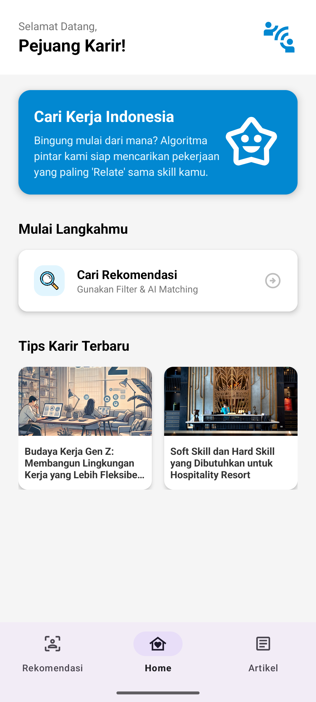
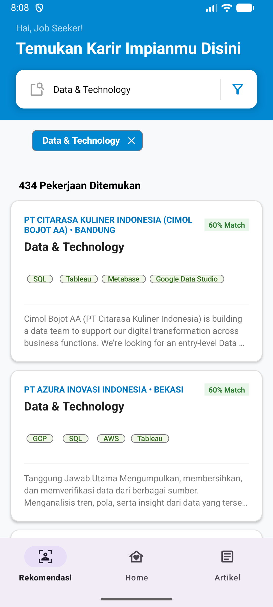

# 🇮🇩 Aplikasi Cari Kerja Indonesia


**Aplikasi Cari Kerja Indonesia** adalah platform mobile berbasis Android yang menghubungkan pencari kerja dengan peluang karir, serta menyediakan wawasan karir (artikel) yang interaktif. Dibangun dengan **Kotlin** dan **Firebase**, aplikasi ini mengusung desain modern ("Gen Z Friendly") yang bersih dan mudah digunakan.

---

## ✨ Fitur Unggulan

### 📱 User Interface (Gen Z Style)
- **Modern & Minimalis:** Desain antarmuka yang bersih (Clean UI) dengan penggunaan whitespace yang lega dan tipografi yang berani (*Big Bold Typography*).
- **Interactive Elements:** Animasi halus dan feedback visual yang responsif.

### 📝 Artikel & Wawasan Karir (Rich Text Editor)
- **Baca Artikel:** Pengguna dapat membaca tips karir dengan format yang rapi.
- **Admin Editor:** Fitur khusus admin untuk menulis artikel layaknya menggunakan Microsoft Word/Google Docs.
  - **Formatting:** Bold, Italic, Underline, Heading (H1, H2).
  - **Styling:** Mengubah warna teks dan menyisipkan gambar via URL.
  - **Teknologi:** Menggunakan library `richeditor-android` yang dikonversi menjadi HTML untuk disimpan di Firestore.

### 🔥 Backend & Cloud
- **Firebase Firestore:** Penyimpanan data real-time untuk lowongan kerja dan artikel.
- **Real-time Updates:** Data artikel dan lowongan diperbarui secara langsung tanpa perlu refresh manual.

---

## 🛠️ Tech Stack

* **Bahasa:** [Kotlin](https://kotlinlang.org/)
* **Framework UI:** Android XML (ConstraintLayout, Material Design Components)
* **Database:** Google Firebase Firestore
* **Libraries Utama:**
    * `jp.wasabeef:richeditor-android` (Untuk fitur Text Editor canggih)
    * `com.google.android.material:material` (Komponen UI Modern)
    * `com.github.bumptech.glide:glide` (Untuk memuat gambar)

---

## 📸 Screenshots

| Halaman Utama | Detail Artikel | Editor Admin |
|:---:|:---:|:---:|
| *(Upload screenshot Home)* | *(Upload screenshot Detail)* | *(Upload screenshot Editor)* |
|  |  |  |

> *Catatan: Screenshot sedang dalam proses pembaruan.*

---

## 🚀 Cara Menjalankan Project

1.  **Clone Repositori**
    ```bash
    git clone [https://github.com/KeijiChoco14/AplikasiCariKerjaIndonesia.git](https://github.com/KeijiChoco14/AplikasiCariKerjaIndonesia.git)
    ```

2.  **Buka di Android Studio**
    * Buka Android Studio -> File -> Open -> Pilih folder project.

3.  **Setup Firebase**
    * Buat project baru di [Firebase Console](https://console.firebase.google.com/).
    * Aktifkan **Firestore Database**.
    * Download file `google-services.json` dari Firebase Console.
    * Letakkan file tersebut di folder `app/` dalam project ini.

4.  **Sync Gradle**
    * Pastikan koneksi internet lancar untuk mendownload dependencies.
    * Klik tombol "Sync Now" atau "Elephant Icon".

5.  **Run**
    * Jalankan di Emulator atau Device Fisik.

---

## 👨‍💻 Tim Pengembang

Project ini dikembangkan sebagai bagian dari studi di **Politeknik Caltex Riau**.

* **Albert Christian** - *Lead Developer*
* **Febriana** - *Developer / UI Designer*

---

## 📄 Lisensi

Distributed under the MIT License. See `LICENSE` for more information.

---
*Dibuat dengan ❤️ dan ☕ di Pekanbaru.*
